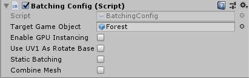
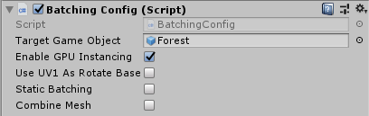
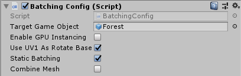
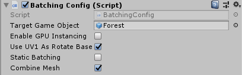

尝试了一些将Billboard合批绘制的方法，包含原始方案共产生了4个场景，其配置和截图如下：

| index | 使用方案 | 配置选项 | 运行截图 |
| --- | --- | --- | --- |
| 1 | 对照组，不合批 |  |  |
| 2 | 使用GPUInstancing |  |  |
| 3 | 静态合批 |  |  |
| 4 | 合并网格 |  |  |

详情请运行各场景，并参考`BatchingConfig`脚本。
